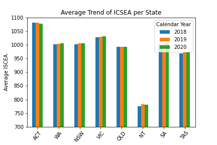

# Most Ideal State

This Project aims to identify which state is the best to live in based on a selection of factors
1 Crime
2 Schools
3 Unemployment
4 Housing

Contributors - Caroline Badocha, Daniel Kenworthy, Jose Sandoval & Balvinder Rajbans

# Project Structure

```
project
|__ .gitignore          # gitignore file
|__ requirements.txt    # conda environment
| 
|__ School Data/        # contains data and notebooks
|   |__ school_data_clean.ipynb         # cleaning notebook that takes in the raw data and outputs cleaned data for analysis
|   |__ school_data_analysis.ipynb     # analysis notebook that contains charts
|   |__ Output          # cleaned data & snippets from jupyter
|   |__ Resources     # raw data
|
|__ Employment_Underemployment/        # contains data and notebooks
|   |__ employment_analysis.ipynb      # cleaning notebook that takes in the raw data and outputs cleaned data for analysis
|   |__ Output          # cleaned data & snippets from jupyter
|   |__ Resources       # raw data
|
|__ Crime Data/        # contains data and notebooks
|   |__ Crime in state.ipynb      # cleaning notebook that takes in the raw data and outputs cleaned data for analysis
|   |__ Output          # cleaned data & snippets from jupyter
|   |__ Resources       # raw data
|
|__ Housing Data Complete/        # contains data and notebooks
|   |__ Housing Data      # cleaning notebook that takes in the raw data and outputs cleaned data for analysis
|   |__Images          # cleaned data & snippets from jupyter
|   |__ Resources       # raw data
```
# Questions
1. Crime
2. Underemployment
3. Which Australian state would be the best for children to attend?
4. Housing
5. Based on these criteria which state is best to live in?

# Datasets
|No|Source|Link|
|-|-|-|
|1|Australian Bureau of Statistics - Housing|https://www.abs.gov.au/statistics/people/housing/housing-occupancy-and-costs/2019-20|
|2|Australian Curriculum, Assessment and Reporting Authority|https://www.acara.edu.au/contact-us/acara-data-access|
|3|Australian Bureau of Statistics - Crime and Justice|https://www.abs.gov.au/statistics/people/crime-and-justice/recorded-crime-offenders/2020-21#data-download|
|4|Australian Bureau of Statistics - Labour Force|https://www.abs.gov.au/statistics/labour/employment-and-unemployment/labour-force-australia/latest-release#key-statistics|

# Analysis

### Question 1 - Crime


### Question 2 - Underemployment


### Question 3 - Schools



### Question 4 - Housing


### Question 5 - Based on these criteria which state is best to live in?